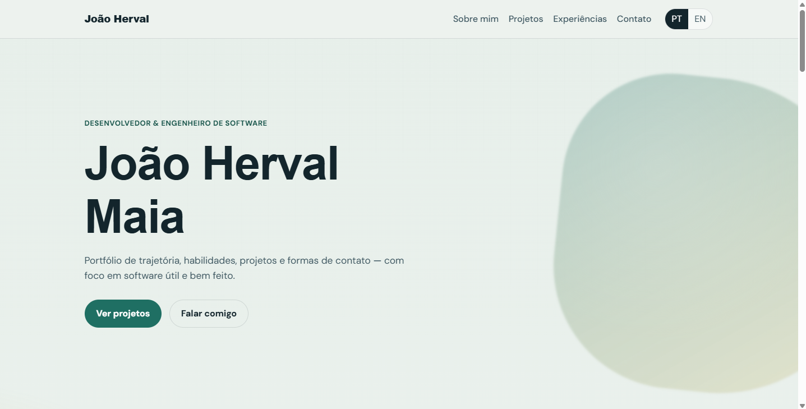
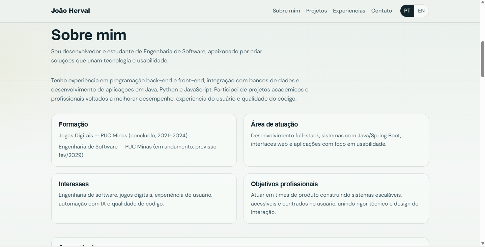
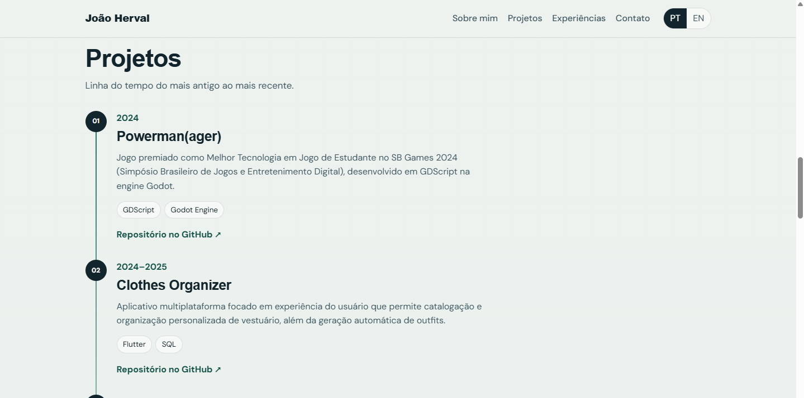
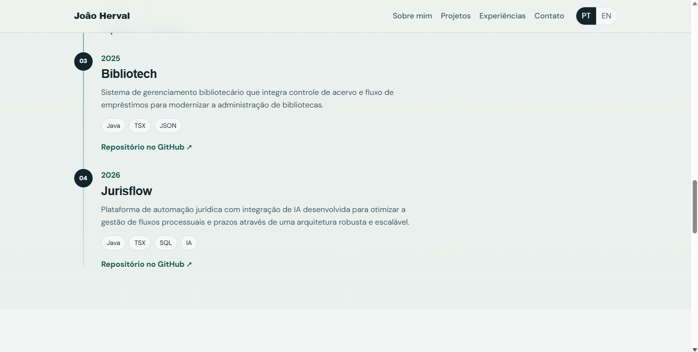
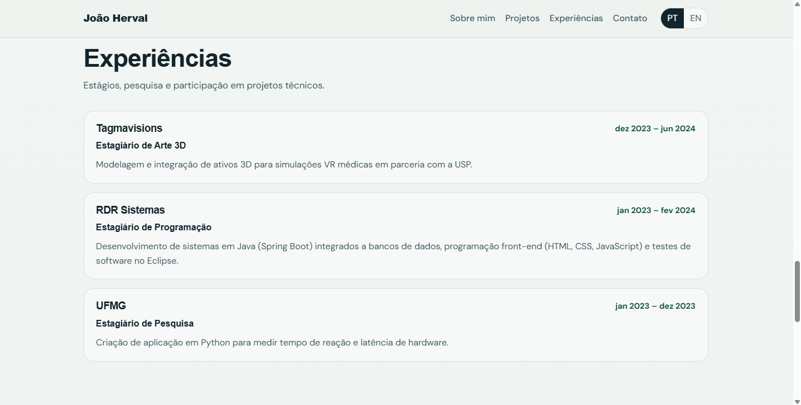
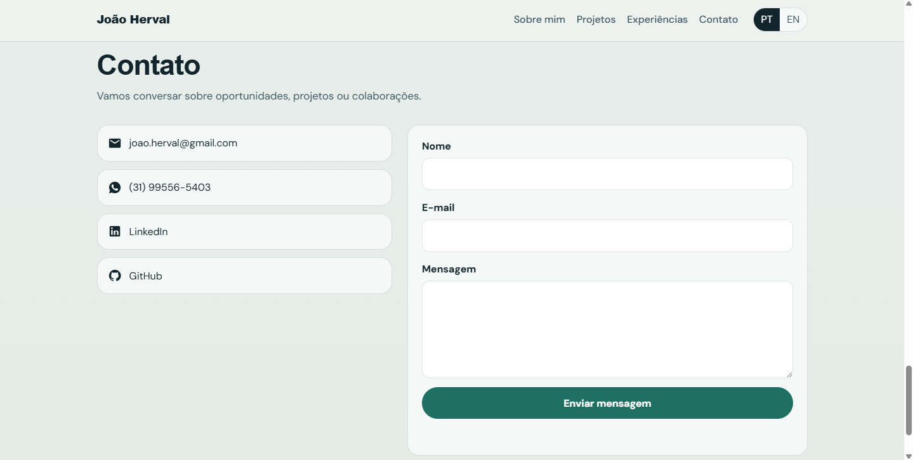

# Portfólio Profissional — João Herval Maia

Site de portfólio moderno e acessível para apresentar trajetória, habilidades, projetos e formas de contato de **João Herval Maia**, estudante de Engenharia de Software na PUC Minas.

O sistema é uma página única (SPA) com navegação por seções, layout responsivo (cabeçalho, área de conteúdo e rodapé) e conteúdo baseado no currículo profissional.

> **Protótipo inicial de front-end** (React + Vite). O deploy em nuvem (Vercel/Render/etc.) e o link público podem ser adicionados na etapa seguinte.

## Imagens dos protótipos

### Dashboard / Hero



### Sobre mim



### Projetos





### Experiências



### Contato



## Descrição do projeto

O portfólio apresenta:

1. **Sobre mim** — apresentação em português e inglês (formação, área de atuação, interesses, objetivos e competências)
2. **Projetos** — linha do tempo do mais antigo ao mais recente, com descrição, tecnologias e link no GitHub
3. **Experiências** — estágios e atividades (empresa, cargo, período e descrição)
4. **Contato** — ícones clicáveis (e-mail, WhatsApp, LinkedIn, GitHub) e formulário com envio de e-mail

## Tecnologias previstas / utilizadas

- HTML5, CSS3 e JavaScript
- [React](https://react.dev/) 19
- [Vite](https://vite.dev/) 8
- Google Fonts (Syne + DM Sans)
- FormSubmit (envio de e-mail do formulário, sem backend próprio)
- Hospedagem prevista em nuvem gratuita (ex.: Vercel, Render, Fly.io)

### Dependências e bibliotecas/frameworks

| Pacote | Uso |
| --- | --- |
| `react` / `react-dom` | Interface em componentes |
| `vite` | Bundler e servidor de desenvolvimento |
| `@vitejs/plugin-react` | Suporte a JSX/React no Vite |
| `oxlint` | Lint (`npm run lint`) |

Não há UI kit externo (Mantine/MUI): o visual é CSS próprio, alinhado à identidade do perfil.

## Estrutura inicial do site

```text
SitePortfólioProfissional/
├── Imagens/                 # prints do protótipo (README)
│   ├── Dashboard.png
│   ├── SobreMim.png
│   ├── Projetos1.png
│   ├── Projetos2.png
│   ├── Experiencias.png
│   └── Contato.png
├── public/
│   └── favicon.svg
├── src/
│   ├── components/
│   │   ├── About.jsx
│   │   ├── Contact.jsx
│   │   ├── Experiences.jsx
│   │   ├── Footer.jsx
│   │   ├── Hero.jsx
│   │   ├── Navbar.jsx
│   │   └── Projects.jsx
│   ├── data/
│   │   └── content.js
│   ├── App.css
│   ├── App.jsx
│   ├── index.css
│   └── main.jsx
├── index.html
├── package.json
├── vite.config.js
└── README.md
```

Layout principal:

- **Cabeçalho** — marca + menu (Sobre mim, Projetos, Experiências, Contato) + PT/EN
- **Área de conteúdo** — seções âncora da página
- **Rodapé** — copyright e idiomas

## Instalação e execução local

Pré-requisitos: Node.js 18+ e npm.

```bash
cd SitePortfólioProfissional
npm install
npm run dev
```

Abra o endereço exibido no terminal (geralmente `http://localhost:5173`).

Outros comandos:

```bash
npm run build    # gera a pasta dist/
npm run preview  # pré-visualiza o build de produção
npm run lint
```

## Link do site publicado na nuvem

_Ainda não publicado._ Após o deploy, atualize este item com a URL.

## Observações

- Conteúdo baseado no currículo de João Herval Maia.
- No primeiro envio pelo FormSubmit, confirme o e-mail na caixa de entrada de `joao.herval@gmail.com`.
